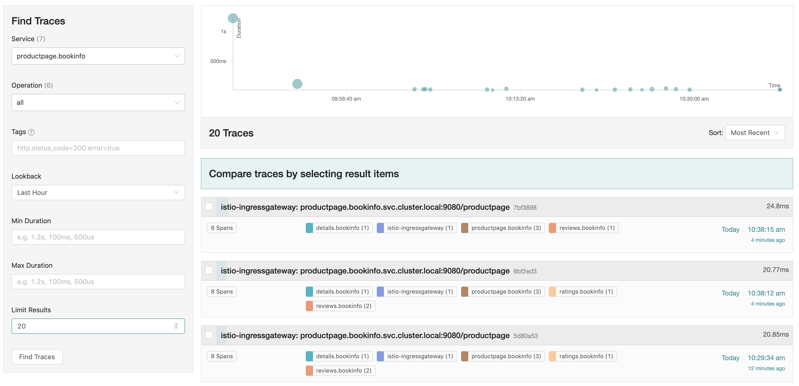
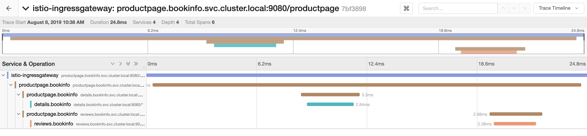

# Distributed tracing

Distributed tracing enables users to track a request through the mesh that is distributed across multiple services. This allows a deeper understanding about request latency, serialization and parallelism via visualization.

Istio leverages [Envoy’s distributed tracing](https://www.envoyproxy.io/docs/envoy/v1.10.0/intro/arch_overview/tracing) feature to provide tracing integration out of the box. Specifically, Istio provides options to install various tracing backend and configure proxies to send trace spans to them automatically. See [Zipkin](https://istio.io/docs/tasks/telemetry/distributed-tracing/zipkin/), [Jaeger](https://istio.io/docs/tasks/telemetry/distributed-tracing/jaeger/) and [LightStep](https://istio.io/docs/tasks/telemetry/distributed-tracing/lightstep/) task docs about how Istio works with those tracing systems.

Read: https://istio.io/docs/tasks/telemetry/distributed-tracing/overview/

## Trace context propagation

Although Istio proxies are able to automatically send spans, they need some hints to tie together the entire trace. Applications need to propagate the appropriate HTTP headers so that when the proxies send span information, the spans can be correlated correctly into a single trace.

To do this, an application needs to collect and propagate the following headers from the incoming request to any outgoing requests:

* `x-request-id`
* `x-b3-traceid`
* `x-b3-spanid`
* `x-b3-parentspanid`
* `x-b3-sampled`
* `x-b3-flags`
* `x-ot-span-context`

When you make downstream calls in your applications, make sure to include these headers.

## Trace sampling

Istio captures a trace for all requests by default when installing with the demo profile. For example, when using the Bookinfo sample application above, every time you access /productpage you see a corresponding trace in the dashboard. **This sampling rate is suitable for a test or low traffic mesh**. For a high traffic mesh you can lower the trace sampling percentage in one of two ways:

* During the mesh setup, use the Helm option `pilot.traceSampling` to set the percentage of trace sampling. See the [Helm Install](https://istio.io/docs/setup/kubernetes/install/helm/) documentation for details on setting options.
* In a running mesh, edit the `istio-pilot` deployment and change the environment variable with the following steps:

    1. To open your text editor with the deployment configuration file loaded, run the following command:

        ~~~bash
        # Edit the istio system option
        $ kubectl -n istio-system edit deploy istio-pilot
        ~~~

    1. Find the `PILOT_TRACE_SAMPLING` environment variable, and change the value: to your desired percentage.

In both cases, valid values are from `0.0` to `100.0` with a precision of `0.01`.

## Zipkin versus Jaeger

Read the [complete article](https://logz.io/blog/zipkin-vs-jaeger/) for a detailed comparison, here is the conclusion:

> Both projects are strong request-tracing solutions. So which one makes the most sense for you? The decision-making begins by considering the official supported languages. Jaeger officially supports most you’ll find in production. Next comes supported libraries and frameworks. Initially, it seems that Zipkin comes out on top, but Jaeger has far more potential since it works with any open tracing instrumentation library. This aspect of the decision comes down to what your tech stack is, how much is already instrumented by the community, and how much—if at all—you want to instrument yourself. However, there is a point we’ve not covered yet. [Jaeger is also compatible with Zipkin’s API](https://www.jaegertracing.io/docs/features/#BackwardscompatibilitywithZipkin), so it’s possible to use Zipkin instrumentation libraries with Jaeger’s collector.

> Deployment is the other facet. This comes down to the pre-existing infrastructure. If Kubernetes is running in production, then adopt Jaeger. If there’s no existing container infrastructure than Zipkin, it makes for a better fit because there are fewer moving pieces. Also, consider a self-hosted solution for the data layer. Unfortunately, there’s no complete hosted Jaeger or Zipkin solutions, so accept the responsibility that comes with understanding and operating new production systems.

> Here’s a simple recommendation. Evaluate Jaeger first and see how it fits into your existing solution. If Jaeger doesn’t fit, then go with Zipkin.

And that is what we are going to do... we will try Jaeger first!

## Jaeger distributed tracing

Let's access the dashboard - similar as what we did for Kiali we open another terminal and run a port-forwarding process:

~~~bash
# Keep this running inside a terminal
$ kubectl -n istio-system port-forward \
   $(kubectl -n istio-system get pod -l app=jaeger \
      -o jsonpath='{.items[0].metadata.name}') \
   15032:16686
~~~

Open your browser to the [Jaeger Console](http://localhost:15032).

### Inspecting traces

Since we still have the traffic generator running (as explained in [Visualise mesh with Kiali --> generating a service graph](./visualize-mesh-with-kiali.md), we can directly jump into tracing.

**Note** _To see trace data, you must send requests to your service. The number of requests depends on Istio’s sampling rate. You set this rate when you install Istio. The default sampling rate is 1%. You need to send at least 100 requests before the first trace is visible. To send a 100 requests to the productpage service, use the following command:_

~~~bash
$ for i in `seq 1 100`; do 
   curl -s -o /dev/null http://$GATEWAY_URL/productpage; 
done
~~~

From the left-hand pane of the dashboard, select `productpage.bookinfo` from the Service drop-down list and click Find Traces:

Next, click on the most recent trace at the top to see the details corresponding to the latest request to the `/productpage`:

The trace is comprised of a set of spans, where each span corresponds to a Bookinfo service, invoked during the execution of a `/productpage` request, or internal Istio component, for example: `istio-ingressgateway`.

### Integrate Jaeger into Kiali Dashboard

Kiali has the ability to show traces obtained from Istio. Jaeger collects traces for monitoring and troubleshooting microservices-based distributed systems , and both Istio and Kiali use the data that Jaeger provides.

Originally this was done via a separate tab in the UI. But that turned out to be impractical. So the Kiali team has been working with the Jaeger team on the Jaeger integration. By improving the Jaeger UI components to make them embeddable, there is better integration between a Kiali selection and a Jaeger selection, making it easier to enrich Jaeger with Kiali information.

With this feature we can focus in the observability by correlating this, for example it may be possible to stand on a node in the graph, do a right-click and then select “traces involving this node”.

The integration can be enabled if deployed via [Istio HelmCharts](https://istio.io/docs/setup/kubernetes/install/helm/) - this feature is not enabled using the demo setup we have today.
