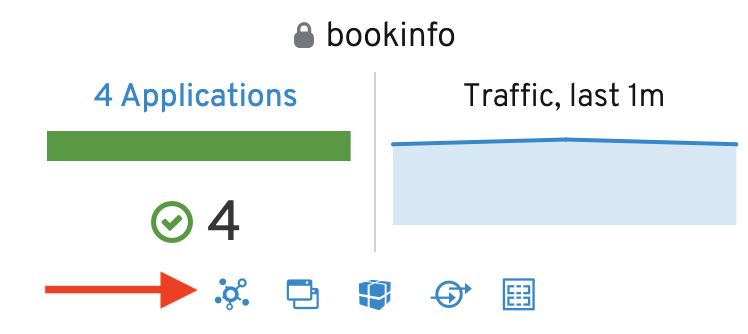
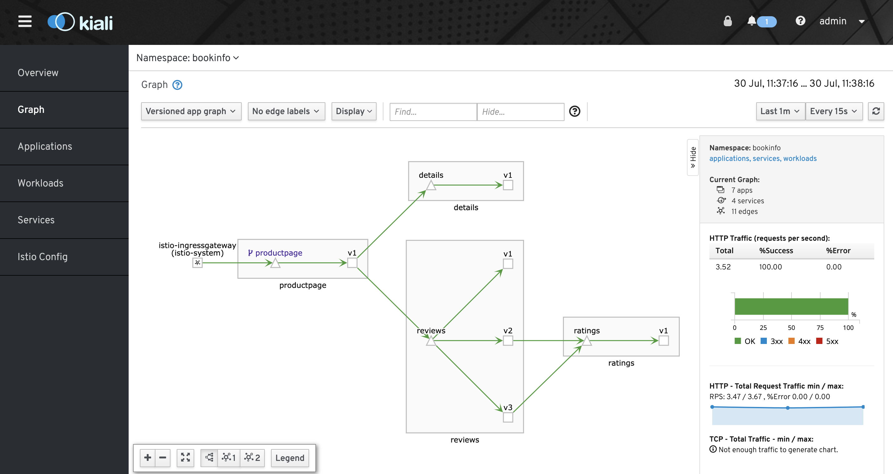
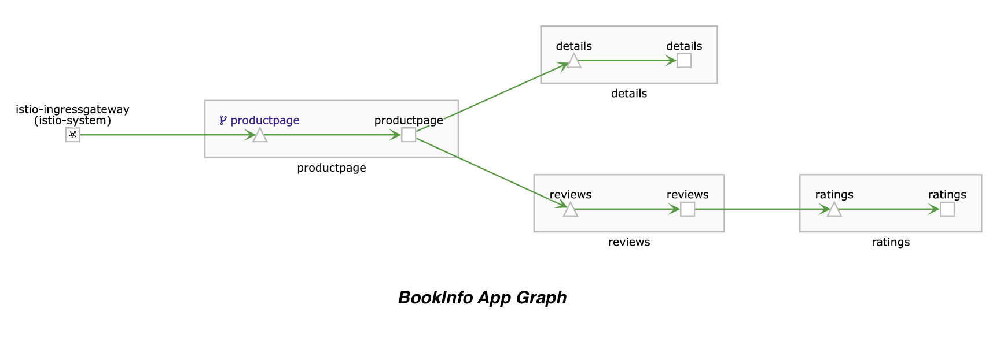
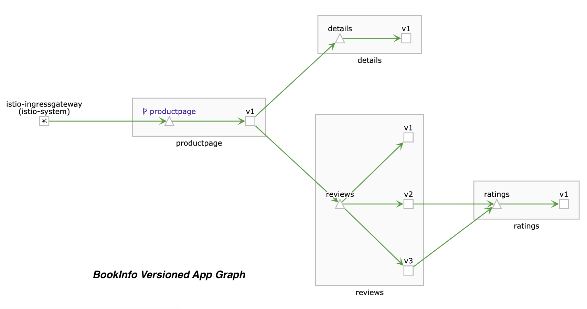
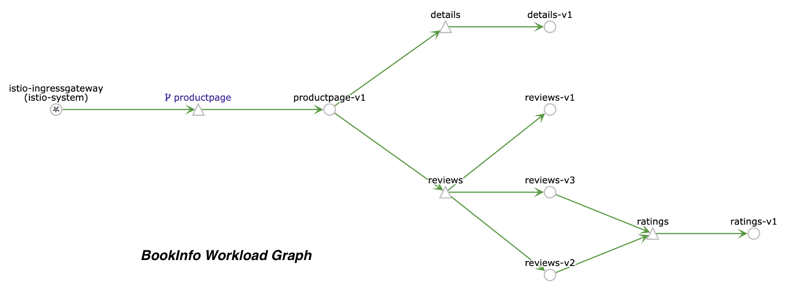
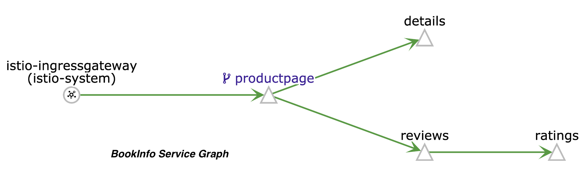
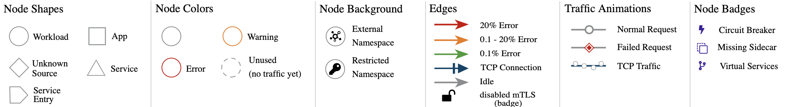
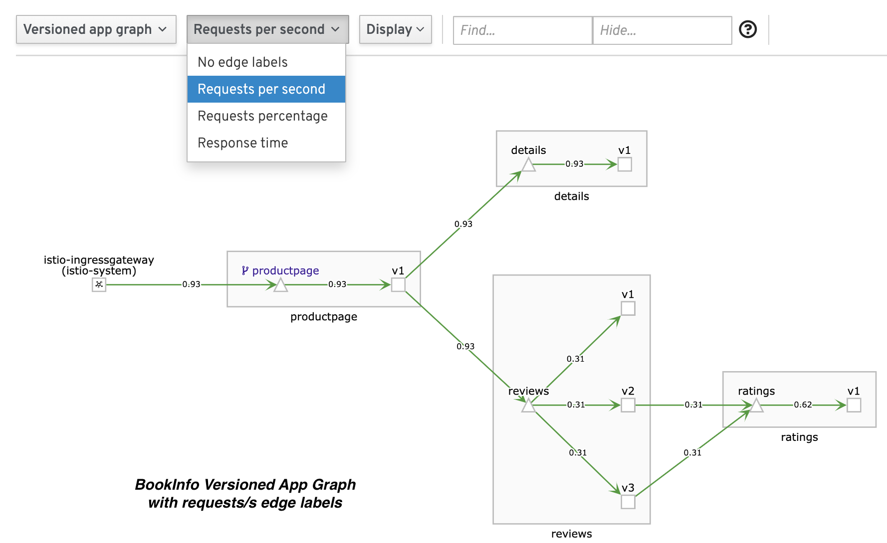

# Visualize your mesh using the Kiali UI

Here we play around with some of the UI's capabilities to visualize the flows and configuration within Istio.

## Login to the Kiali Console

Kiali visualises the service graphs in the system; to verify if the console is deployed, run:

~~~bash
# Check if service is running...
$  kubectl -n istio-system get svc kiali

NAME      TYPE        CLUSTER-IP       EXTERNAL-IP   PORT(S)     AGE
kiali     ClusterIP   10.107.136.186   <none>        20001/TCP   3h
~~~

To open the Kiali UI, execute the following command in your Kubernetes environment:

~~~bash
# Keep this running in a terminal!
$ kubectl -n istio-system port-forward \
   $(kubectl -n istio-system get pod -l app=kiali -o jsonpath='{.items[0].metadata.name}') \
   20001:20001
~~~

Visit [http://localhost:20001/kiali/console](http://localhost:20001/kiali/console) in your web browser, use `admin`/`admin` to login.

## Generating a service graph

Let's start by sending some traffic to the services we have deployed so we can assess the information collected by Kiali. The command below will sent very second an HTTP request for the `productpage` which will in return invoke the different versions of the `review` service.

~~~bash
# Install watch via 'brew install watch' if not available...
$ watch -n 1 curl -o /dev/null -s -w %{http_code} $GATEWAY_URL/productpage
~~~

...keep this running and switch the the [Kiali Console](http://localhost:20001/kiali/console) in your browser and click on the click on the bookinfo graph icon in the Bookinfo namespace card as shown below:

The page looks similar to:

To view a **summary of metrics**, select any node or edge in the graph to display its metric details in the summary details panel on the right.

### Graphs and types

To view your service mesh using **different graph types**, select a graph type from the **Graph Type** drop down menu. There are several graph types to choose from: **App**, **Versioned App**, **Workload**, **Service**.

* The **App** graph type aggregates all versions of an app into a single graph node. The following example shows a **single reviews node** representing the three versions of the reviews app.

* The **Versioned App** graph type shows a node for each version of an app, but all versions of a particular app are grouped together. The following example shows the **reviews** group box that contains the three nodes that represents the three versions of the reviews app.

* The **Workload** graph type shows a node for each workload in your service mesh. This graph type does not require you to use the `app` and `version` labels so if you opt to not use those labels on your components, this is the graph type you will use.

* The **Service** graph type shows a node for each service in your mesh but excludes all apps and workloads from the graph.

**Tip**: _you want to know the exact meaning of all these icons, lines and badges? Click on the **Legend** button on the left bottom of the graph!_

### Dive into metrics

In order to assess what traffic is exchanged between the different nodes, we are going to enable some additional information in the graphs.

For the examples below, we used the **Versioned App Graph** view.

* Enable the **Requests per second** for the edge labels; notice how traffic is coming into the `productpage` with nearly 1 req/s, but (round-robin) load-balanced across the 3 versions of the `reviews` service, hence giving it a `0.3 req/s` hit rate as shown below:
 
* Repeat the same step as above, now play around with **Requests percentage** and **Response time** between the nodes
* Move your mouse over the **edge communication lines** connecting the nodes and notice how the graph highlights the active nodes in the communication flow and depicts the **protocol**
* Click on the `productpage` service node and see its metrics reflected on the right side.
  * Notice the type (`Service`) and the badge information (`Has Virtual Service`)
  * Click on the `Service` link and notice you are redirected to the service details section (as part of the left side of the menu bar)

### Examine configuration and problems

To examine the details about the Istio configuration, click on the **Applications**, **Workloads**, and **Services** menu icons on the left menu bar.

## More details

I found it very useful to read through the [Kiali feature list](https://www.kiali.io/documentation/features/) and following the examples live in the console.

## Open ends

* It seems the action menu is greyed out for Suspend Traffic?
* Why are there no [wizards](https://www.kiali.io/documentation/features/#_istio_wizards) available in my action menu?
* Tracing is not working -- requires [additional setup for Jaeger](./distributed-tracing-with-jaeger.md)
* Assess the [runtimes monitoring/dashboards](https://www.kiali.io/documentation/runtimes-monitoring/) for NodeJs, Java and Golang
* Deploy Kiali in view-only mode to restrict any write operation on Istio configuration (see [Kiali Operator CR](https://github.com/kiali/kiali/blob/master/operator/deploy/kiali/kiali_cr.yaml#L134))
